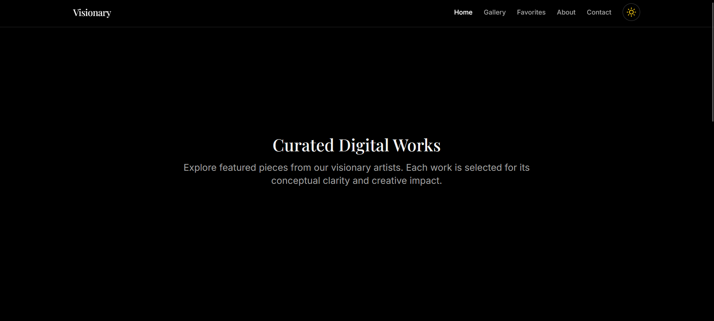
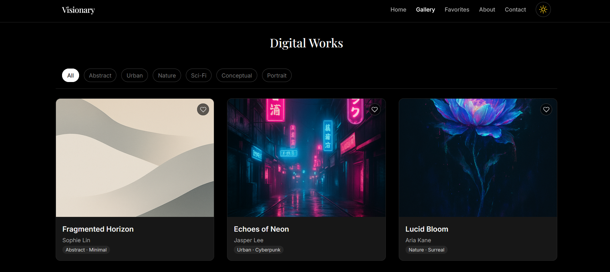
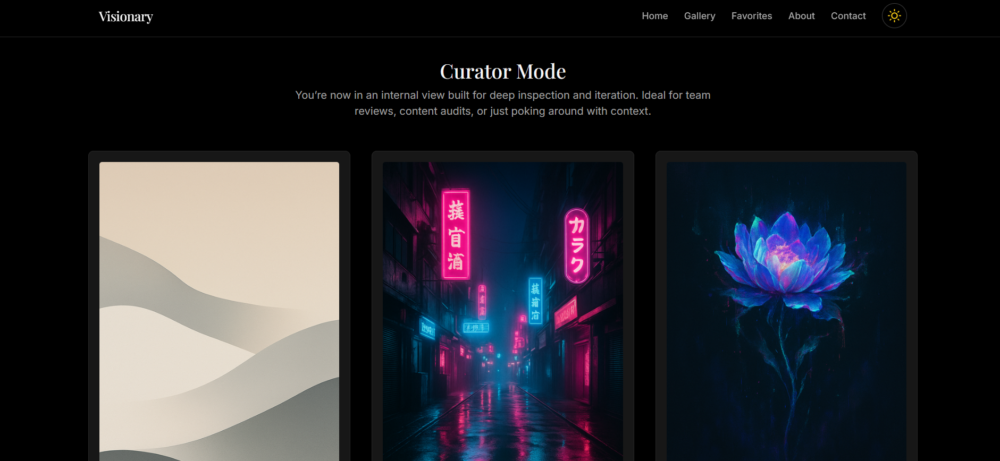

# Visionary Gallery — Curated Digital Art Platform

> _Conceptual clarity. Artistic focus. Digital presence with soul._

---

## 🧭 About Visionary Gallery

**Visionary Gallery** is more than a digital art showcase — it's a **curated exhibition space** crafted for artists and collectors who value conceptual depth and immersive experience.

Meticulously designed for elegance and speed, it offers:
- 🖼️ Category-based filtering, favorites system, and full gallery view  
- 🎨 Curator mode for internal review and edit panels  
- 🌙 Dark/light theme toggle with local preference saving  
- 🧑‍🎨 Artist and artwork metadata (category, style, medium)  
- 🧪 CI-integrated Cypress E2E testing for visual and interaction fidelity  

---

## 🚀 Live Preview

👉 [https://visionary.quimromero.com/](https://visionary.quimromero.com/p)

---

## ✨ Features

- ✅ Add/remove artworks to favorites (persisted locally)
- 🗂️ Filter by artwork category in real-time
- 🌗 Dark/light mode toggle with system detection
- 🖼️ Fullscreen modal lightbox viewer with keyboard support
- 👩‍🎨 Curator Mode for internal mock edits and reviews
- 📱 Fully responsive and optimized for mobile
- 🧪 Cypress-based E2E testing with CI via GitHub Actions

---

## 🧠 Tech Stack

| Tech                        | Role                                    |
|-----------------------------|-----------------------------------------|
| **React + Vite**            | Frontend framework and build tooling    |
| **Zustand (persisted)**     | State management for favorites & modes  |
| **Framer Motion**           | Page transitions and animations         |
| **React Helmet**            | Dynamic meta and SEO                    |
| **Tailwind CSS**            | Utility-first styling                   |
| **Cypress**                 | End-to-end testing                      |
| **GitHub Actions**          | Continuous integration                  |

---

## 🗂 Project Structure

- `src/`
  - `components/` – Gallery cards, modals, navbar, toggles
  - `context/` – Zustand stores for theme, favorites, curator mode
  - `data/` – Artwork dataset (mocked JSON)
  - `pages/` – Route views: Home, Gallery, Favorites, About, Contact, Curator
- `public/` – Images and assets
- `cypress/` – E2E test specs and config

---

## 🧪 End-to-End Testing

Visionary Gallery uses **Cypress** for reliable E2E testing, with each PR and push to `master` triggering checks via **GitHub Actions**.

Currently tested:
- ✅ Gallery renders and displays all artworks
- ✅ Filtering by category updates visible cards
- ✅ Basic ARIA roles present in navigation

Coming soon:
- 🖱️ Modal interactions and favorites toggle
- ⚙️ Theme toggle and layout persistence
- ♿️ Full accessibility audits

🧪 [View CI status →](https://github.com/quim-romero/visionary-gallery/actions)

---

## 📸 Screenshots

| Home | Gallery | CuratorView |
|------|---------|-----------|
|  |  |  |

---

## 🧩 Notes

- 🧠 Fully handcrafted UI — no templates or design libraries
- 🔍 Prioritizes readability, visual clarity, and user intent
- 🚀 Built as a **portfolio project** to demonstrate frontend depth

---

## 📬 Contact

If you're seeking a frontend developer who merges **visual finesse with purposeful architecture**:

- 📧 quim@quimromero.com  
- 🌐 [https://quimromero.com](https://quimromero.com)

---

> _Visionary Gallery brings art into a digital form that feels human —  
> where clarity, composition, and code converge._
