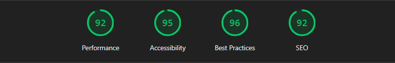

# Visionary Gallery — Curated Digital Art Platform


> _Conceptual clarity. Artistic focus. Digital presence with soul._

---

## 🧭 About Visionary

**Visionary Gallery** is more than a showcase — it’s a **curated exhibition space** for digital art, crafted for artists and collectors who value conceptual depth and immersive presentation.

Designed for elegance and speed, it features:

- 🖼️ Category filters, favorites, and a full gallery view  
- 🎨 **Curator Mode** for internal review with mock edit panels  
- 🌙 Light/Dark mode with system detection + local persistence  
- 🧑‍🎨 Artwork metadata (category, style, medium)  
- 🎞️ Accessible lightbox with keyboard support (focus trap, ESC)  
- 🧪 CI-run Cypress E2E tests for visual and interaction fidelity

> Built as a portfolio project that behaves like a real product.

---

## 🚀 Live Preview

👉 https://visionary.quimromero.com/

---

## ✨ Features

- ✅ Add/remove artworks to **Favorites** (persisted locally via Zustand)
- 🗂️ **Real-time filtering** by artwork category
- 🌓 **Theme toggle** (system preference + localStorage)
- 🖼️ **Fullscreen lightbox** (keyboard navigation, focus management)
- 🎛️ **Curator Mode** (local mock edits, non-persistent)
- 🎬 Page and route transitions with **Framer Motion**
- 🔍 SEO via **React Helmet**
- 📱 Fully responsive, mobile-first
- 🧪 E2E testing with **Cypress** and GitHub Actions

---

## 🧠 Tech Stack

| Tech                         | Role                                  |
| --------------------------- | ------------------------------------- |
| **React + Vite**            | Core framework & build tooling        |
| **React Router DOM**        | Routing                               |
| **Zustand (persist)**       | Favorites & feature flags             |
| **Framer Motion**           | Animations & transitions              |
| **React Helmet**            | Meta tags & SEO                       |
| **Tailwind CSS**            | Utility-first styling                 |
| **Cypress**                 | E2E testing                           |
| **GitHub Actions**          | CI (lint, build, tests)               |
| **Lighthouse CI (LHCI)**    | Perf/Accessibility audits (CI)        |

---

## 🗂 Project Structure

- `src/`  
  - `components/` – Gallery cards, lightbox modal, navbar, toggles  
  - `context/` – Zustand stores (theme, favorites, curator mode)  
  - `data/` – Artwork dataset (mock JSON)  
  - `pages/` – Home, Gallery, Favorites, About, Contact, Curator  
- `public/` – Images, fonts, favicon  
- `cypress/` – E2E specs & config

---

## 🧪 End-to-End Testing

Visionary runs **Cypress** on each PR and push to `main` via **GitHub Actions**.

**Currently tested**

- ✅ Smoke: `/` responds 200; essential landmarks exist (`main`, `nav`, `footer`)  
- ✅ Internal routing works from home  
- ✅ Gallery filtering by category updates visible cards  
- ✅ Basic accessibility checks on navbar roles & theme toggle

**Coming soon**

- 🖼️ Lightbox interactions & keyboard flow  
- 💚 Favorites toggle behavior and persistence  
- 🌓 Theme persistence refinements & focus rings  
- ♿ Expanded **axe** accessibility coverage across pages

🧪 **CI status:** https://github.com/quim-romero/visionary/actions

---

## ♿ Accessibility & ⚡ Performance

**Accessibility**

- Keyboard-navigable UI (modal focus trap, ESC to close) and ARIA labels in key components.  
- Planned: automated audits with `cypress-axe` in CI.

**Performance**

- **Lighthouse CI** runs against the production build in CI with thresholds:



Generate locally:

```bash
npm run build
npm run lh:ci
```

---

## 📸 Screenshots

| Home                            | Gallery                          | Curator Mode                        |
| --------------------------------| -------------------------------- | ----------------------------------- |
|  |  |  |

---

## 🧩 Notes

- 🧠 All UI is handcrafted — no templates or UI kits  
- 🔍 Typography and motion tuned for clarity and presence  
- 🎯 Built as a **portfolio project** to demonstrate real product thinking

---

## 📬 Contact

Looking for a frontend dev who blends **visual finesse with purposeful architecture**?

- 📧 quim@quimromero.com  
- 🌐 https://quimromero.com

---

> _Visionary Gallery brings art into a digital form that feels human —  
> where clarity, composition, and code converge._
